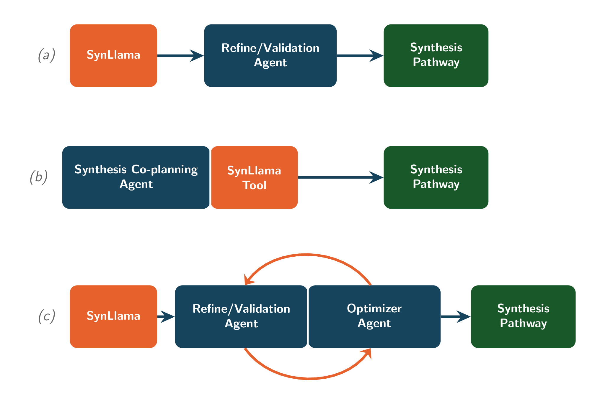

# SynAgent

Agentic retrosynthesis planning and synthetic pathway reconstruction interfaced with [SynLlama](https://github.com/THGLab/SynLlama).

<div align="center">
    
</div>

## Installation

```sh
# 1. Clone the repo
git clone https://github.com/lukasmki/SynAgent.git
cd SynAgent

# 2. Setup virtual environment
## if you have `uv` installed
uv sync

## if you don't, create venv manually
python3 -m venv .venv
source .venv/bin/activate
pip install .

# 3. Verify installation
synagent --help
```

## Configuration

API keys are read from a `.env` file in the working directory.

```sh
cp .env.sample .env  # then fill in a key
```

The default model is `google:gemini-3-flash-preview`, so `GOOGLE_API_KEY` is all
that's needed out of the box. Every command takes `--model` with any
[pydantic-ai](https://ai.pydantic.dev/models/) model identifier, for example
`--model anthropic:claude-sonnet-5` or `--model openai:gpt-5`.

## Usage

### Interactive REPL

```sh
synagent                                       # bare invocation, default model
synagent cli                                   # same, but accepts flags
synagent cli --model anthropic:claude-sonnet-5
```

Tool calls and thinking stream as the agent works. Inside the REPL: `/help` shows
the commands, `/clear` resets the conversation history, and `exit` (or `quit`,
`/exit`, Ctrl-C) quits.

### Web server

```sh
synagent serve                                 # http://localhost:8000
synagent serve --host 0.0.0.0 --port 8080
```

### Workflows

`synagent run <workflow> <request>` runs one of the predefined workflows and prints
the resulting model as JSON on stdout.

| Workflow | Input | Output |
| --- | --- | --- |
| `generation` | natural-language request | `SynLlamaFormat` synthesis path |
| `validation` | `SynLlamaFormat` JSON | `ValidationReport` |
| `correction` | `ValidationReport` JSON | corrected `ValidationReport` |
| `pipeline` | natural-language request | `ValidationReport` (generate → validate → correct, up to 4 iterations) |

```sh
# Plan a route from a natural-language request
synagent run generation "Synthesize ibuprofen from commercially available blocks"

# Generate, validate, then self-correct until the route is valid
synagent run pipeline "Propose a 3-step route to celecoxib" > report.json
```

Note that `validation` and `correction` take a JSON document rather than prose —
they are the individual stages of `pipeline`, meant to be chained:

```sh
synagent run generation "Route to aspirin" > route.json
synagent run validation "$(cat route.json)" > report.json
synagent run correction "$(cat report.json)"
```

A `SynLlamaFormat` path, the input `validation` expects, looks like this:

```json
{
  "reactions": [
    {
      "reaction_number": 1,
      "reaction_template": "[OH:1][c:2].[Cl:3][C:4]=[O:5]>>[O:1]([c:2])[C:4]=[O:5]",
      "reactants": ["Oc1ccccc1C(=O)O", "CC(=O)Cl"],
      "product": "CC(=O)Oc1ccccc1C(=O)O"
    }
  ],
  "building_blocks": ["Oc1ccccc1C(=O)O", "CC(=O)Cl"]
}
```

### Tracing

`serve`, `cli`, and `run` all accept the same observability flags.

```sh
# JSONL trace under .synagent/traces/YYYY-MM-DD/<HHMMSS>-<pid>.jsonl
synagent run pipeline "Route to aspirin" --trace

# Explicit destination; --trace-path implies --trace
synagent cli --trace-path runs/session.jsonl

# Send spans to Logfire as well
synagent serve --logfire --trace
```

`--trace-path` accepts either a `.jsonl` file, used verbatim, or a directory, in
which case a timestamped file is created inside it. Traces record every model
request/response pair, including sub-agent runs, linked to the parent by run id.

### Exporting traces

`synagent trace export` converts traces into a chat-format supervised fine-tuning
dataset.

```sh
synagent trace export '.synagent/traces/**/*.jsonl' -o dataset.jsonl

# Only trajectories that produced a valid route, main agent only
synagent trace export '.synagent/traces/**/*.jsonl' -o dataset.jsonl \
    --only-successful --agent synagent --min-steps 2
```

Quote the glob so it reaches the CLI rather than being expanded by the shell.
`--agent` filters to one agent's calls — `synagent` (the main agent), `validator`,
`analogue`, or `worker` — and `--include-thinking` keeps thinking content as
`reasoning_content` on each target.
