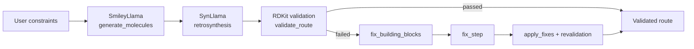
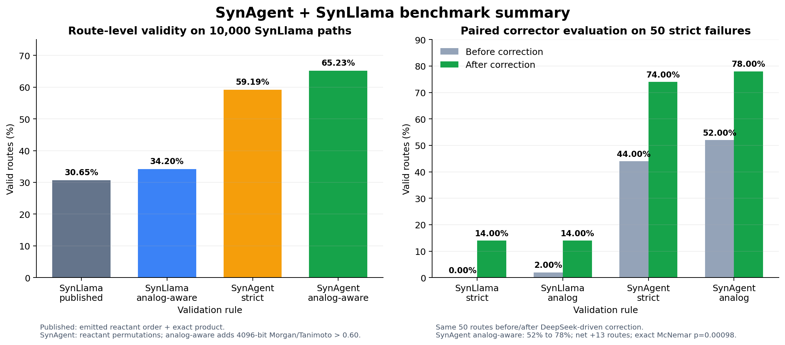
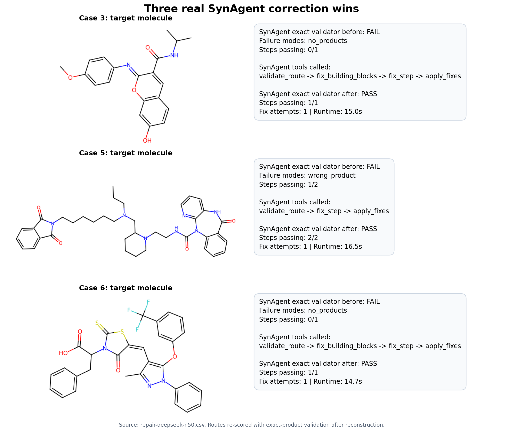

# SynAgent

Agentic retrosynthesis planning and synthetic pathway reconstruction interfaced with [SynLlama](https://github.com/THGLab/SynLlama).

<div align="center">
    
</div>

## Full pipeline

The `synagent-full-pipeline` branch combines the specialist chemistry models
with deterministic RDKit validation and an agent-driven correction loop.



The orchestrator chooses tools through Pydantic AI. SmileyLlama and SynLlama
remain specialist model tools; route validation and correction are auditable
Python/RDKit operations. `ReactionResult` records exact versus analog product
matches, the selected product, and its Morgan/Tanimoto score.

### Current ChEMBL evidence

The complete evidence package is under
[`docs/chembl-benchmark/comparison-2026-08-27/`](docs/chembl-benchmark/comparison-2026-08-27/README.md).

<div align="center">
    
</div>

- Published SynLlama rule reproduced exactly: **3,065/10,000 = 30.65%**.
- Analog-aware emitted-order scoring: **3,420/10,000 = 34.20%**.
- SynAgent reactant-permutation validation, exact product: **59.19%**.
- SynAgent permutation + analog validation: **65.23%**.
- In the paired 50-route correction pilot, the SynAgent analog-aware pass rate
  increased from **52% before correction to 78% after correction**.

These figures do not mean the underlying SynLlama generations improved. The
full-data difference mostly measures more robust validation of the same model
outputs. The n=50 result isolates the separate correction effect, but remains a
length-filtered pilot rather than a paper-scale estimate.

### Genuine agent execution

The branch includes an uncropped Pydantic AI conversation in which SynAgent
called all six pipeline tools and converted a three-step route from 2/3 passing
to 3/3 passing:

[`docs/chembl-benchmark/screenshots/full-pipeline-with-repair.png`](docs/chembl-benchmark/screenshots/full-pipeline-with-repair.png)

Three additional correction wins, reconstructed from the real DeepSeek n=50
batch and re-scored after repair, are shown here:

<div align="center">
    
</div>

## Installation

```sh
# 1. Clone the repo
git clone https://github.com/lukasmki/SynAgent.git
cd SynAgent

# 2. Setup virtual environment
## if you have `uv` installed
uv sync

## if you don't, create venv manually
python3 -m venv .venv
source .venv/bin/activate
pip install .

# 3. Verify installation
synagent --help
```
