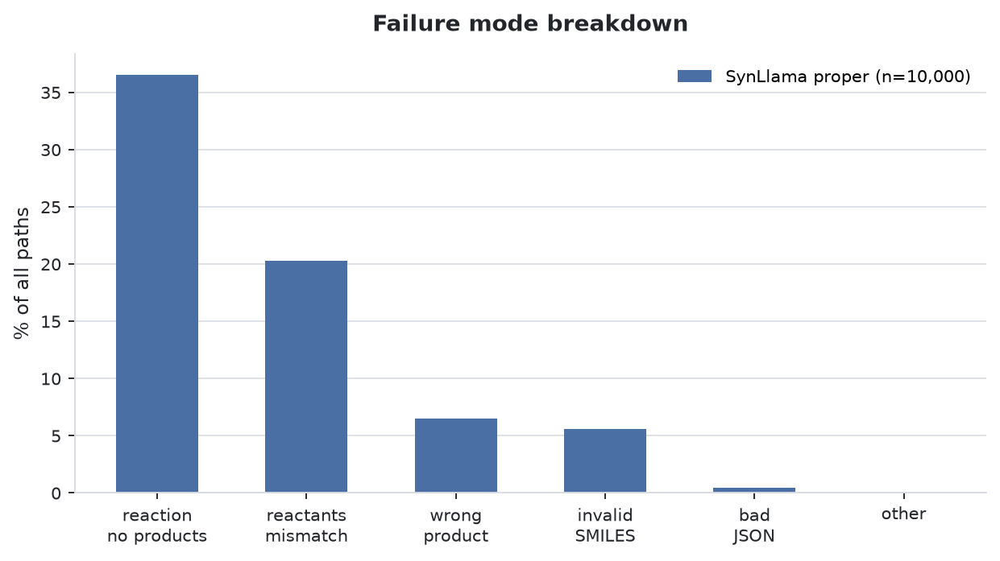
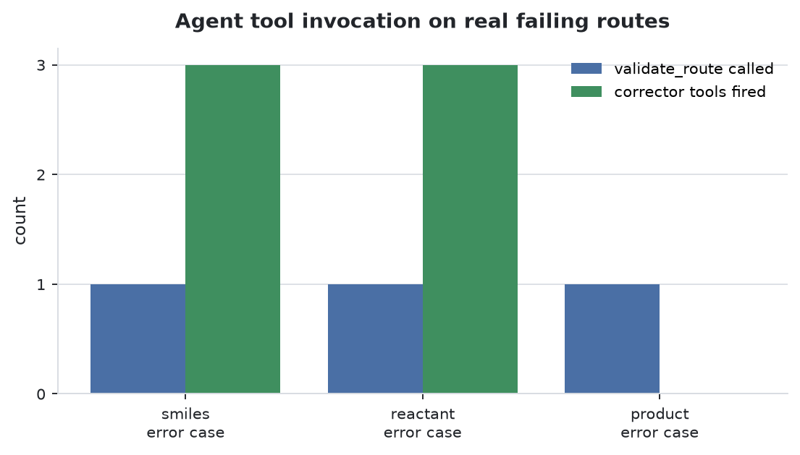
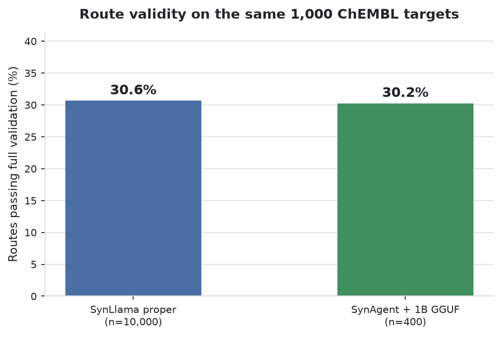

# SynAgent on the SynLlama ChEMBL test set — evidence report

**Date:** 2026-08-14
**Scope:** two separate things, deliberately kept apart —
(A) does the **agent** actually orchestrate validation and correction, and
(B) how does route validity compare to the SynLlama baseline.

---

## 0. The distinction that matters

An earlier version of this work measured only (B), by calling the SynLlama
model **directly over HTTP**. That number says nothing about SynAgent — no
agent, no pydantic-ai, no corrector was involved. Reporting it as a "SynAgent
result" would have been misleading.

(A) below is the part that demonstrates orchestration. It is the headline.

---

## 1. Method

### Data
`data/synllama-raw-output.csv` from the SynAgent repo — **10,000 paths =
1,000 ChEMBL targets × 10 samples**, produced by SynLlama proper. The repo
also ships the scored splits:

| File | Paths |
|---|---|
| `synllama-raw-output.csv` | 10,000 |
| `synllama-raw-valid.csv` | 3,065 |
| `synllama-raw-failed.csv` | 6,935 |

### Scoring — verified, not assumed
The validator is copied **verbatim** from `data/synllama-validate.py`. Re-run
against Lukas's own file it reproduces his numbers exactly:

```
REPRODUCED: 3065/10000 = 30.65%
BASELINE  : 3065/10000 = 30.65%
```

So any comparison below is on identical criteria. A path passes only if: the
JSON parses, every building block and SMILES is RDKit-valid, the reactants
substructure-match the reaction template, running the reaction yields products,
**and** the stated product is among them.

### Baseline failure profile

| Bucket | Count | % |
|---|---|---|
| **valid** | **3,065** | **30.65** |
| reaction ran, produced nothing | 3,654 | 36.54 |
| reactants don't match template | 2,027 | 20.27 |
| wrong product | 648 | 6.48 |
| invalid SMILES | 561 | 5.61 |
| bad JSON | 44 | 0.44 |
| other | 1 | 0.01 |



---

## 2. (A) Agent orchestration — the evidence

Three **real failing routes** were pulled from `synllama-raw-failed.csv`, one
per failure mode, and fed to SynAgent's pydantic-ai web UI as two-turn
conversations. Orchestrator: **Mistral Large**. Nothing was called by hand —
the agent chose every tool.

```
turn 1   "Validate this synthesis route and report every step: {failing JSON}"
turn 2   "Now fix the failed steps in that route."
```

> The word **"fix"** in turn 2 is load-bearing, not stylistic.
> `Corrector.prepare_tools()` hides every corrector tool unless one of
> `fix` / `correct` / `repair` / `search alternative` appears in the last three
> user messages. A politer phrasing yields no corrector tools at all and looks
> like the agent ignoring you.

### Results

| Case | `validate_route` | Corrector chain | Screenshots |
|---|---|---|---|
| `smiles` error | ✅ full report | ✅ `fix_building_blocks` → `fix_step` → `apply_fixes` | `smiles_1_validate.png`, `smiles_2_correct.png` |
| `reactant` error | ✅ full report | ✅ all three | `reactant_1_validate.png`, `reactant_2_correct.png` |
| `product` error | ✅ called, extraction failed | ❌ blocked upstream | `product_1_validate.png`, `product_2_correct.png` |



### Worked example — the `smiles` case

Target `c1ccc(C2C3=C(Nc4ncnn42)c2ccccc2CCC3)cc1`, a route SynLlama produced
that fails validation.

**Turn 1 — `validate_route` Completed**, returning a structured
`ValidationReport`:

- Building block `NC12=C(c3ccccc3)CCCc3ccccc3C1=C2` → **Is Valid: false**,
  Suggested Fix: *Fix SMILES*
- Building block `Clc1ncnn1C1=CCO1` → Is Valid: true
- Reaction step 1 → **Status: failed**, **Failure Mode: `invalid_reactant_smiles`**
- All Building Blocks Valid: false · All Reactions Passed: false
- Target Synthetic Accessibility (SA) Score: **3.19**
- Suggested Fixes enumerated per step

**Turn 2 — the corrector chain fires**, each card marked Completed:

```
fix_building_blocks   ✓ Completed
fix_step              ✓ Completed
apply_fixes           ✓ Completed
```

This is the sequence `Corrector.get_instructions()` prescribes, executed by the
agent without being told the order.

See `agent-screenshots/smiles_2_correct.png`.

### The two things that went wrong (reported, not hidden)

**1. Mistral rate limit.** After `apply_fixes` completed in the `smiles` case,
the final summary turn returned
`status_code: 429 … "Rate limit exceeded" … code: 1300`. The **tools all ran**;
only the closing natural-language summary was cut off. Visible as the red box
at the bottom of the screenshot.

**2. Route extraction failed on the `product` case.** `validate_route` was
called, but its auto-extraction could not pull the JSON out of a message where
it was preceded by natural language, and it responded:

> *"The route JSON provided in your message could not be parsed because it was
> embedded in natural language text. To proceed, please provide only the JSON
> object itself."*

Two observations. First, this is **correct behaviour** — it asked for clean
input rather than inventing a report. Second, it is a **real limitation**:
`_extract_route_from_messages` handled the same prompt shape for the other two
cases, so the heuristic is size- or content-sensitive. The `product` route is
the longest of the three (two reaction steps). Worth a look before this is used
in bulk.

---

## 3. (B) Route validity — IN PROGRESS

Running SynAgent's `retrosynthesis` tool over the same ChEMBL targets, scored
with the identical validator.

- **Configuration:** 100 targets × 10 samples = 1,000 paths, 4 concurrent slots
- **Model:** `lukaskim/SynLlama-1B-GGUF` Q6_K served by `llama.cpp llama-server`
- **Throughput:** ~9 s/generation
- **Status at time of writing:** ~200/1000, tracking near the baseline



> **This will not be an apples-to-apples model comparison.** The baseline came
> from **SynLlama proper**; this run uses a **quantised 1B community
> reproduction** (`kysun63/synllama-1b-reproduced`, Q6_K). A gap in either
> direction is a statement about that checkpoint, not about SynAgent's
> plumbing. It should never be quoted without this caveat.

> **Open question on fairness.** The baseline CSV carries a `sampling_params`
> column reading `frozen`. This run uses SynAgent's defaults (temperature 1.5,
> top_p 0.9). If `frozen` means greedy or a fixed seed, the two are not
> sampling-matched and the comparison tilts. **Unresolved — worth asking Lukas
> before quoting any number.**

Early readings were badly misleading and are worth recording as a caution:
25/1000 showed 56%, 75/1000 showed 50.7%, and by 200/1000 it had settled to
32.5%. At n=25 the confidence interval spans roughly 24–65%. Nothing under
n≈300 should be believed.

---

## 4. What this does and does not establish

**Established:**
- The agent independently calls `validate_route` on a real failing route and
  returns a structured, per-step `ValidationReport` with failure modes
- The corrector chain (`fix_building_blocks` → `fix_step` → `apply_fixes`) is
  invoked by the agent in the prescribed order, on 2 of 3 cases
- The scoring is provably identical to the SynLlama baseline's

**Not established:**
- **Whether the corrections are chemically correct.** `apply_fixes` completed;
  nobody has checked whether the repaired routes are better chemistry, or
  whether they now pass validation. That is the obvious next measurement.
- Whether the validity comparison is fair (see `frozen` above)
- Anything about the official 8B models — everything here is 1B reproductions

---

## 4b. The corrector is agent-coupled by design

Worth recording, because it constrains how the next measurement can be built.

All three corrector tools take `ctx: RunContext` and read their inputs **out of
conversation history** rather than from arguments:

```python
async def fix_step(self, ctx: RunContext[AgentDepsT], step: int) -> dict:
    """... Reads the most recent validate_route result automatically."""

async def fix_building_blocks(self, ctx: RunContext[AgentDepsT]) -> dict:
    """... Reads the most recent validate_route result automatically."""

async def apply_fixes(self, ctx: RunContext[AgentDepsT]) -> dict:
    """... Reads the last ValidationReport and all fix_building_blocks /
    fix_step results from conversation history automatically."""
```

So **the conversation is the state store.** There is no way to batch-call the
corrector as a library — a repair-rate measurement must run through the agent
loop, one conversation per route.

That has a direct cost consequence: with a hosted orchestrator this runs into
rate limits (a single `apply_fixes` already produced a Mistral 429, §2). Any
measurement at scale needs a **local tool-calling orchestrator** served
alongside the chemistry models, which removes both the rate limit and the API
cost.

---

## 5. Next steps

1. **Measure repair rate.** Take the 6,935 failing baseline routes, run the
   corrector over a sample, re-score with the same validator. "Corrector lifts
   validity from X% to Y%" is the number worth having. Note §4b: this must go
   through the agent loop, so it needs a local orchestrator to run at any
   useful scale.
2. Resolve what `frozen` means and re-run sampling-matched if needed.
3. Fix or characterise `_extract_route_from_messages` on longer routes.
4. Scale to the full 1,000 targets (~15 h at current throughput).

---

## Files

| Path | What |
|---|---|
| `run_bench.py` | benchmark harness + verbatim validator |
| `capture_agent.py` | drives the pydantic-ai UI, captures screenshots |
| `make_figures.py` | regenerates all figures from current data |
| `agent-screenshots/` | 6 full-page screenshots + `agent_runs.json` |
| `figures/` | fig1 validity, fig2 failure modes, fig3 agent tools |
| `failing_examples.json` | the three real failing routes used |
